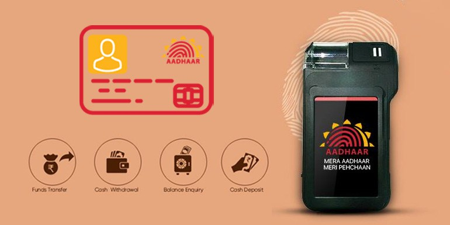

## आधार कार्डने व्यवहार करा 

बँक प्रतिनिधी किंवा Micro-ATM च्या माध्यमातून व्यवहार करण्याची सुविधा आधार प्रणित प्रणालीद्वारे मिळते.

AEPS चा लाभ घेण्यासाठी, आपले आधार कार्ड बँकेच्या खात्याशी संलग्न असायला हवे.

या प्रणाली मार्फत व्यवहार करताना आपल्याला कोणतेही पासवर्ड लक्षात ठेवायची गरज नाही.

---

## प्रणाली मार्फत मिळणाऱ्या सेवा

- खात्यांवरील रकमेची चौकशी
- रक्कम काढणे
- रक्कम भरणे 
- आधार ते आधार रक्कम ट्रान्सफर 

---
## आधार प्रणित प्रणालीमध्ये व्यवहार कसा कराल ?

1.  आपल्या नजीकच्या Micro-ATM किंवा बँक प्रतिनिधीला भेट द्या.
2. आपल्या बँकेचे नाव आणि आधार कार्ड नंबर सांगा.
3. जो व्यवहार करायचा आहे तो निवडा.
4. स्कॅनरवर आपले फिंगरप्रिंट स्कॅन करा.
5. व्यवहार पूर्ण झाल्यावर आपल्याला व्यवहाराची पावती मिळेल.
